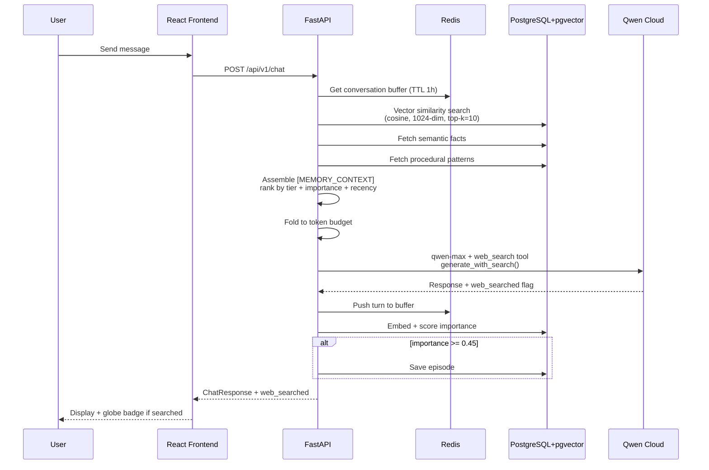
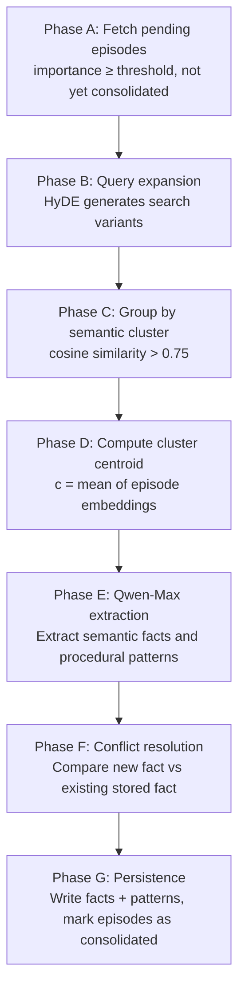
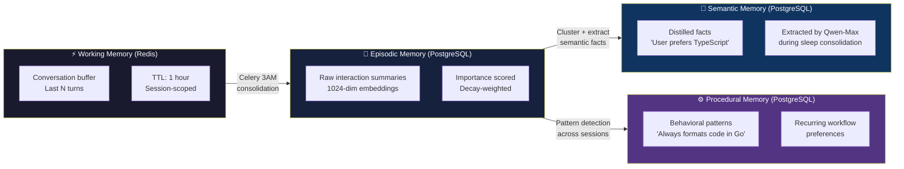
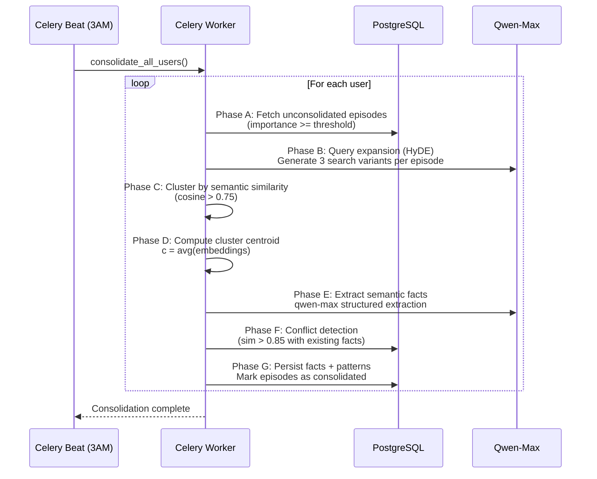
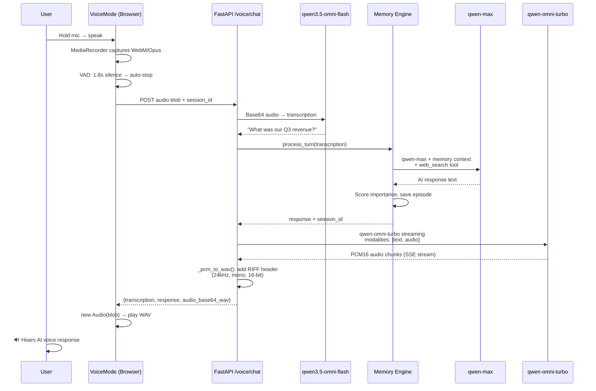

<div align="center">


# Hipocampus

**Persistent Memory Infrastructure for AI Assistants**

*A biologically-grounded, four-tier hippocampal memory architecture enabling cross-session context retention for large language models*

[](LICENSE)
[](https://python.org)
[](https://fastapi.tiangolo.com)
[](https://react.dev)
[](https://github.com/pgvector/pgvector)
[](https://dashscope.aliyun.com)

**[Live Demo](https://disk-studying-imagination-concern.trycloudflare.com) · [Architecture](#-system-architecture) · [Mathematics](#-mathematical-foundations) · [Qwen APIs](#-qwen-cloud-api-usage)**

</div>

---

<svg xmlns="http://www.w3.org/2000/svg" xmlns:xlink="http://www.w3.org/1999/xlink" width="2000" zoomAndPan="magnify" viewBox="0 0 1500 1499.999933" height="2000" preserveAspectRatio="xMidYMid meet" version="1.0"><defs><g/><clipPath id="130b0a5d2c"><path d="M 822 804 L 1068.609375 804 L 1068.609375 1050 L 822 1050 Z M 822 804 " clip-rule="nonzero"/></clipPath><clipPath id="e7378e704b"><path d="M 431.109375 175.097656 L 669 175.097656 L 669 1051.847656 L 431.109375 1051.847656 Z M 431.109375 175.097656 " clip-rule="nonzero"/></clipPath><clipPath id="040c68d98a"><rect x="0" width="1298" y="0" height="281"/></clipPath></defs><g clip-path="url(#130b0a5d2c)"><path fill="#ffffff" d="M 1068.570312 926.863281 C 1068.570312 928.875 1068.519531 930.882812 1068.421875 932.890625 C 1068.324219 934.898438 1068.175781 936.902344 1067.976562 938.902344 C 1067.78125 940.902344 1067.535156 942.894531 1067.238281 944.882812 C 1066.945312 946.871094 1066.601562 948.851562 1066.210938 950.824219 C 1065.816406 952.792969 1065.375 954.753906 1064.886719 956.703125 C 1064.398438 958.65625 1063.863281 960.589844 1063.28125 962.515625 C 1062.699219 964.4375 1062.066406 966.34375 1061.390625 968.238281 C 1060.710938 970.128906 1059.988281 972.003906 1059.21875 973.863281 C 1058.453125 975.71875 1057.636719 977.554688 1056.777344 979.371094 C 1055.917969 981.1875 1055.015625 982.984375 1054.066406 984.757812 C 1053.121094 986.53125 1052.128906 988.277344 1051.097656 990 C 1050.0625 991.726562 1048.988281 993.421875 1047.871094 995.09375 C 1046.753906 996.765625 1045.597656 998.40625 1044.402344 1000.023438 C 1043.203125 1001.636719 1041.96875 1003.222656 1040.691406 1004.773438 C 1039.417969 1006.328125 1038.105469 1007.847656 1036.753906 1009.339844 C 1035.40625 1010.828125 1034.019531 1012.28125 1032.597656 1013.703125 C 1031.175781 1015.125 1029.722656 1016.511719 1028.234375 1017.859375 C 1026.742188 1019.210938 1025.222656 1020.523438 1023.667969 1021.796875 C 1022.113281 1023.074219 1020.53125 1024.308594 1018.917969 1025.507812 C 1017.300781 1026.703125 1015.660156 1027.859375 1013.988281 1028.976562 C 1012.316406 1030.09375 1010.621094 1031.167969 1008.894531 1032.203125 C 1007.171875 1033.234375 1005.421875 1034.226562 1003.652344 1035.171875 C 1001.878906 1036.121094 1000.082031 1037.023438 998.265625 1037.882812 C 996.449219 1038.742188 994.613281 1039.558594 992.757812 1040.328125 C 990.898438 1041.09375 989.023438 1041.820312 987.132812 1042.496094 C 985.238281 1043.171875 983.332031 1043.804688 981.410156 1044.386719 C 979.484375 1044.96875 977.550781 1045.503906 975.597656 1045.996094 C 973.648438 1046.484375 971.6875 1046.921875 969.71875 1047.316406 C 967.746094 1047.707031 965.765625 1048.050781 963.777344 1048.34375 C 961.789062 1048.640625 959.796875 1048.886719 957.796875 1049.082031 C 955.796875 1049.28125 953.792969 1049.429688 951.785156 1049.527344 C 949.777344 1049.625 947.769531 1049.675781 945.757812 1049.675781 C 943.75 1049.675781 941.742188 1049.625 939.734375 1049.527344 C 937.726562 1049.429688 935.722656 1049.28125 933.722656 1049.082031 C 931.722656 1048.886719 929.726562 1048.640625 927.738281 1048.34375 C 925.75 1048.050781 923.769531 1047.707031 921.800781 1047.316406 C 919.828125 1046.921875 917.867188 1046.484375 915.917969 1045.992188 C 913.96875 1045.503906 912.03125 1044.96875 910.109375 1044.386719 C 908.1875 1043.804688 906.277344 1043.171875 904.386719 1042.496094 C 902.492188 1041.820312 900.617188 1041.09375 898.761719 1040.328125 C 896.90625 1039.558594 895.066406 1038.742188 893.25 1037.882812 C 891.433594 1037.023438 889.640625 1036.121094 887.867188 1035.171875 C 886.09375 1034.226562 884.347656 1033.234375 882.621094 1032.203125 C 880.898438 1031.167969 879.199219 1030.09375 877.527344 1028.976562 C 875.859375 1027.859375 874.214844 1026.703125 872.601562 1025.507812 C 870.988281 1024.308594 869.402344 1023.074219 867.847656 1021.796875 C 866.296875 1020.523438 864.773438 1019.210938 863.285156 1017.859375 C 861.796875 1016.511719 860.339844 1015.125 858.917969 1013.703125 C 857.496094 1012.28125 856.113281 1010.828125 854.761719 1009.339844 C 853.414062 1007.847656 852.101562 1006.328125 850.824219 1004.773438 C 849.550781 1003.222656 848.3125 1001.636719 847.117188 1000.023438 C 845.917969 998.40625 844.761719 996.765625 843.644531 995.09375 C 842.53125 993.421875 841.453125 991.726562 840.421875 990 C 839.386719 988.277344 838.398438 986.53125 837.449219 984.757812 C 836.503906 982.984375 835.597656 981.1875 834.738281 979.371094 C 833.878906 977.554688 833.066406 975.71875 832.296875 973.863281 C 831.527344 972.003906 830.804688 970.128906 830.128906 968.238281 C 829.449219 966.34375 828.820312 964.4375 828.238281 962.515625 C 827.652344 960.589844 827.117188 958.65625 826.628906 956.703125 C 826.140625 954.753906 825.699219 952.792969 825.308594 950.824219 C 824.917969 948.851562 824.574219 946.871094 824.277344 944.882812 C 823.984375 942.894531 823.738281 940.902344 823.539062 938.902344 C 823.34375 936.902344 823.195312 934.898438 823.097656 932.890625 C 823 930.882812 822.949219 928.875 822.949219 926.863281 C 822.949219 924.855469 823 922.847656 823.097656 920.839844 C 823.195312 918.832031 823.34375 916.828125 823.539062 914.828125 C 823.738281 912.828125 823.984375 910.832031 824.277344 908.84375 C 824.574219 906.855469 824.917969 904.875 825.308594 902.90625 C 825.699219 900.933594 826.140625 898.972656 826.628906 897.023438 C 827.117188 895.074219 827.652344 893.136719 828.238281 891.214844 C 828.820312 889.292969 829.449219 887.382812 830.128906 885.492188 C 830.804688 883.597656 831.527344 881.722656 832.296875 879.867188 C 833.066406 878.011719 833.878906 876.171875 834.738281 874.355469 C 835.597656 872.539062 836.503906 870.746094 837.449219 868.972656 C 838.398438 867.199219 839.386719 865.453125 840.421875 863.726562 C 841.453125 862.003906 842.53125 860.304688 843.644531 858.636719 C 844.761719 856.964844 845.917969 855.320312 847.117188 853.707031 C 848.3125 852.09375 849.550781 850.507812 850.824219 848.953125 C 852.101562 847.402344 853.414062 845.878906 854.761719 844.390625 C 856.113281 842.902344 857.496094 841.445312 858.917969 840.023438 C 860.339844 838.601562 861.796875 837.21875 863.285156 835.867188 C 864.773438 834.519531 866.296875 833.207031 867.847656 831.929688 C 869.402344 830.65625 870.988281 829.417969 872.601562 828.222656 C 874.214844 827.023438 875.859375 825.867188 877.527344 824.75 C 879.199219 823.636719 880.898438 822.558594 882.621094 821.527344 C 884.347656 820.492188 886.09375 819.503906 887.867188 818.554688 C 889.640625 817.609375 891.433594 816.703125 893.25 815.84375 C 895.066406 814.984375 896.90625 814.171875 898.761719 813.402344 C 900.617188 812.632812 902.492188 811.910156 904.386719 811.234375 C 906.277344 810.554688 908.1875 809.925781 910.109375 809.34375 C 912.03125 808.757812 913.96875 808.222656 915.917969 807.734375 C 917.867188 807.246094 919.828125 806.804688 921.800781 806.414062 C 923.769531 806.023438 925.75 805.679688 927.738281 805.382812 C 929.726562 805.089844 931.722656 804.84375 933.722656 804.644531 C 935.722656 804.449219 937.726562 804.300781 939.734375 804.203125 C 941.742188 804.105469 943.75 804.054688 945.757812 804.054688 C 947.769531 804.054688 949.777344 804.105469 951.785156 804.203125 C 953.792969 804.300781 955.796875 804.449219 957.796875 804.644531 C 959.796875 804.84375 961.789062 805.089844 963.777344 805.382812 C 965.765625 805.679688 967.746094 806.023438 969.71875 806.414062 C 971.6875 806.804688 973.648438 807.246094 975.597656 807.734375 C 977.550781 808.222656 979.484375 808.757812 981.410156 809.34375 C 983.332031 809.925781 985.238281 810.554688 987.132812 811.234375 C 989.023438 811.910156 990.898438 812.632812 992.757812 813.402344 C 994.613281 814.171875 996.449219 814.984375 998.265625 815.84375 C 1000.082031 816.703125 1001.878906 817.609375 1003.652344 818.554688 C 1005.421875 819.503906 1007.171875 820.492188 1008.894531 821.527344 C 1010.621094 822.558594 1012.316406 823.636719 1013.988281 824.75 C 1015.660156 825.867188 1017.300781 827.023438 1018.917969 828.222656 C 1020.53125 829.417969 1022.113281 830.65625 1023.667969 831.929688 C 1025.222656 833.207031 1026.742188 834.519531 1028.234375 835.867188 C 1029.722656 837.21875 1031.175781 838.601562 1032.597656 840.023438 C 1034.019531 841.445312 1035.40625 842.902344 1036.753906 844.390625 C 1038.105469 845.878906 1039.417969 847.402344 1040.691406 848.953125 C 1041.96875 850.507812 1043.203125 852.09375 1044.402344 853.707031 C 1045.597656 855.320312 1046.753906 856.964844 1047.871094 858.636719 C 1048.988281 860.304688 1050.0625 862.003906 1051.097656 863.726562 C 1052.128906 865.453125 1053.121094 867.199219 1054.066406 868.972656 C 1055.015625 870.746094 1055.917969 872.539062 1056.777344 874.355469 C 1057.636719 876.171875 1058.453125 878.011719 1059.21875 879.867188 C 1059.988281 881.722656 1060.710938 883.597656 1061.390625 885.492188 C 1062.066406 887.382812 1062.699219 889.292969 1063.28125 891.214844 C 1063.863281 893.136719 1064.398438 895.074219 1064.886719 897.023438 C 1065.375 898.972656 1065.816406 900.933594 1066.210938 902.90625 C 1066.601562 904.875 1066.945312 906.855469 1067.238281 908.84375 C 1067.535156 910.832031 1067.78125 912.828125 1067.976562 914.828125 C 1068.175781 916.828125 1068.324219 918.832031 1068.421875 920.839844 C 1068.519531 922.847656 1068.570312 924.855469 1068.570312 926.863281 Z M 1068.570312 926.863281 " fill-opacity="1" fill-rule="nonzero"/></g><path fill="#ffffff" d="M 828.417969 647.628906 L 828.417969 915.761719 L 822.867188 915.761719 L 822.867188 647.628906 C 822.863281 645.992188 822.816406 644.359375 822.734375 642.726562 C 822.652344 641.09375 822.527344 639.464844 822.363281 637.839844 C 822.199219 636.210938 821.996094 634.589844 821.753906 632.972656 C 821.511719 631.359375 821.230469 629.75 820.910156 628.144531 C 820.585938 626.542969 820.226562 624.949219 819.828125 623.363281 C 819.425781 621.78125 818.988281 620.207031 818.511719 618.640625 C 818.035156 617.078125 817.519531 615.527344 816.96875 613.988281 C 816.417969 612.449219 815.828125 610.925781 815.199219 609.417969 C 814.570312 607.910156 813.910156 606.414062 813.207031 604.9375 C 812.507812 603.460938 811.773438 602.003906 811 600.5625 C 810.226562 599.121094 809.421875 597.699219 808.582031 596.296875 C 807.738281 594.898438 806.863281 593.515625 805.957031 592.15625 C 805.046875 590.800781 804.105469 589.464844 803.128906 588.152344 C 802.15625 586.839844 801.152344 585.550781 800.113281 584.289062 C 799.074219 583.023438 798.007812 581.789062 796.910156 580.578125 C 795.8125 579.367188 794.6875 578.183594 793.53125 577.027344 C 792.375 575.871094 791.191406 574.742188 789.980469 573.644531 C 788.769531 572.546875 787.53125 571.480469 786.269531 570.441406 C 785.003906 569.40625 783.71875 568.398438 782.40625 567.425781 C 781.09375 566.453125 779.757812 565.511719 778.398438 564.601562 C 777.039062 563.691406 775.660156 562.816406 774.257812 561.976562 C 772.855469 561.136719 771.4375 560.328125 769.996094 559.558594 C 768.554688 558.785156 767.09375 558.050781 765.617188 557.347656 C 764.140625 556.648438 762.648438 555.984375 761.140625 555.359375 C 759.628906 554.730469 758.105469 554.140625 756.566406 553.585938 C 755.027344 553.035156 753.476562 552.519531 751.914062 552.042969 C 750.351562 551.566406 748.777344 551.128906 747.191406 550.730469 C 745.605469 550.332031 744.011719 549.96875 742.410156 549.648438 C 740.808594 549.328125 739.199219 549.042969 737.582031 548.800781 C 735.964844 548.558594 734.34375 548.355469 732.71875 548.191406 C 731.09375 548.027344 729.460938 547.90625 727.828125 547.820312 C 726.199219 547.738281 724.5625 547.695312 722.929688 547.691406 L 666.632812 547.691406 L 666.632812 542.140625 L 722.929688 542.140625 C 724.65625 542.144531 726.378906 542.1875 728.101562 542.277344 C 729.824219 542.363281 731.546875 542.496094 733.261719 542.667969 C 734.980469 542.839844 736.691406 543.054688 738.398438 543.308594 C 740.101562 543.566406 741.800781 543.863281 743.492188 544.203125 C 745.1875 544.542969 746.867188 544.921875 748.542969 545.34375 C 750.214844 545.765625 751.875 546.226562 753.527344 546.730469 C 755.175781 547.234375 756.8125 547.777344 758.4375 548.359375 C 760.0625 548.945312 761.671875 549.566406 763.265625 550.226562 C 764.855469 550.890625 766.433594 551.589844 767.992188 552.328125 C 769.550781 553.070312 771.089844 553.84375 772.613281 554.660156 C 774.132812 555.476562 775.632812 556.324219 777.113281 557.214844 C 778.59375 558.101562 780.050781 559.027344 781.484375 559.984375 C 782.917969 560.945312 784.328125 561.9375 785.710938 562.964844 C 787.097656 563.996094 788.457031 565.054688 789.789062 566.152344 C 791.125 567.246094 792.429688 568.375 793.707031 569.53125 C 794.988281 570.691406 796.234375 571.878906 797.457031 573.101562 C 798.675781 574.320312 799.867188 575.570312 801.023438 576.847656 C 802.183594 578.125 803.308594 579.433594 804.40625 580.765625 C 805.5 582.097656 806.5625 583.457031 807.589844 584.84375 C 808.617188 586.230469 809.613281 587.640625 810.570312 589.074219 C 811.53125 590.507812 812.453125 591.964844 813.34375 593.445312 C 814.230469 594.921875 815.082031 596.421875 815.894531 597.945312 C 816.710938 599.464844 817.488281 601.003906 818.226562 602.5625 C 818.964844 604.125 819.667969 605.699219 820.328125 607.292969 C 820.992188 608.886719 821.613281 610.496094 822.195312 612.117188 C 822.78125 613.742188 823.324219 615.378906 823.824219 617.03125 C 824.328125 618.679688 824.789062 620.34375 825.210938 622.015625 C 825.632812 623.6875 826.015625 625.371094 826.355469 627.0625 C 826.691406 628.753906 826.992188 630.453125 827.246094 632.160156 C 827.503906 633.867188 827.71875 635.578125 827.890625 637.292969 C 828.0625 639.011719 828.191406 640.730469 828.28125 642.453125 C 828.367188 644.175781 828.414062 645.902344 828.417969 647.628906 Z M 828.417969 647.628906 " fill-opacity="1" fill-rule="nonzero"/><g clip-path="url(#e7378e704b)"><path fill="#ffffff" d="M 668.019531 340.601562 L 668.019531 1052.007812 L 614.914062 1052.007812 C 611.914062 1052.003906 608.914062 1051.925781 605.917969 1051.777344 C 602.917969 1051.625 599.925781 1051.402344 596.941406 1051.105469 C 593.953125 1050.808594 590.976562 1050.4375 588.007812 1049.996094 C 585.039062 1049.554688 582.082031 1049.039062 579.140625 1048.449219 C 576.195312 1047.863281 573.269531 1047.203125 570.359375 1046.472656 C 567.449219 1045.738281 564.554688 1044.9375 561.683594 1044.066406 C 558.8125 1043.191406 555.964844 1042.25 553.140625 1041.234375 C 550.3125 1040.222656 547.515625 1039.140625 544.742188 1037.992188 C 541.96875 1036.84375 539.226562 1035.625 536.515625 1034.339844 C 533.800781 1033.054688 531.121094 1031.707031 528.476562 1030.289062 C 525.828125 1028.875 523.21875 1027.394531 520.644531 1025.851562 C 518.070312 1024.308594 515.539062 1022.699219 513.042969 1021.03125 C 510.546875 1019.363281 508.09375 1017.636719 505.683594 1015.847656 C 503.273438 1014.058594 500.90625 1012.214844 498.585938 1010.308594 C 496.269531 1008.40625 493.996094 1006.445312 491.773438 1004.429688 C 489.546875 1002.414062 487.375 1000.347656 485.253906 998.222656 C 483.128906 996.101562 481.0625 993.929688 479.042969 991.707031 C 477.027344 989.480469 475.070312 987.210938 473.164062 984.890625 C 471.257812 982.570312 469.414062 980.207031 467.625 977.796875 C 465.835938 975.386719 464.105469 972.933594 462.4375 970.4375 C 460.769531 967.941406 459.164062 965.40625 457.621094 962.835938 C 456.074219 960.261719 454.59375 957.652344 453.179688 955.003906 C 451.761719 952.359375 450.414062 949.679688 449.128906 946.964844 C 447.84375 944.253906 446.625 941.511719 445.476562 938.738281 C 444.324219 935.96875 443.242188 933.167969 442.230469 930.34375 C 441.21875 927.519531 440.273438 924.667969 439.398438 921.796875 C 438.527344 918.925781 437.722656 916.035156 436.992188 913.125 C 436.261719 910.214844 435.601562 907.285156 435.011719 904.34375 C 434.421875 901.398438 433.90625 898.445312 433.464844 895.476562 C 433.019531 892.507812 432.652344 889.53125 432.355469 886.542969 C 432.054688 883.558594 431.832031 880.566406 431.679688 877.566406 C 431.53125 874.570312 431.453125 871.570312 431.449219 868.570312 L 431.449219 175.097656 L 502.515625 175.097656 C 505.222656 175.101562 507.929688 175.167969 510.632812 175.304688 C 513.339844 175.441406 516.039062 175.644531 518.730469 175.910156 C 521.425781 176.179688 524.113281 176.511719 526.789062 176.914062 C 529.46875 177.3125 532.136719 177.777344 534.789062 178.308594 C 537.445312 178.839844 540.085938 179.433594 542.710938 180.09375 C 545.339844 180.753906 547.945312 181.480469 550.539062 182.265625 C 553.128906 183.054688 555.699219 183.90625 558.246094 184.820312 C 560.796875 185.734375 563.320312 186.710938 565.820312 187.746094 C 568.324219 188.785156 570.796875 189.882812 573.242188 191.042969 C 575.691406 192.199219 578.109375 193.417969 580.496094 194.695312 C 582.882812 195.972656 585.238281 197.308594 587.558594 198.703125 C 589.882812 200.09375 592.167969 201.542969 594.417969 203.050781 C 596.671875 204.554688 598.882812 206.113281 601.058594 207.726562 C 603.230469 209.339844 605.367188 211.007812 607.457031 212.722656 C 609.550781 214.441406 611.601562 216.210938 613.605469 218.027344 C 615.613281 219.847656 617.574219 221.714844 619.488281 223.628906 C 621.402344 225.542969 623.269531 227.503906 625.089844 229.511719 C 626.90625 231.515625 628.675781 233.566406 630.394531 235.660156 C 632.109375 237.75 633.777344 239.886719 635.390625 242.058594 C 637.003906 244.234375 638.5625 246.445312 640.066406 248.699219 C 641.574219 250.949219 643.023438 253.234375 644.414062 255.558594 C 645.808594 257.878906 647.144531 260.234375 648.421875 262.621094 C 649.699219 265.007812 650.917969 267.425781 652.074219 269.875 C 653.234375 272.320312 654.332031 274.792969 655.371094 277.296875 C 656.40625 279.796875 657.382812 282.320312 658.296875 284.871094 C 659.210938 287.417969 660.0625 289.988281 660.851562 292.578125 C 661.636719 295.171875 662.363281 297.777344 663.023438 300.40625 C 663.683594 303.03125 664.277344 305.671875 664.808594 308.328125 C 665.339844 310.980469 665.804688 313.648438 666.203125 316.328125 C 666.605469 319.003906 666.9375 321.691406 667.207031 324.386719 C 667.472656 327.078125 667.675781 329.777344 667.8125 332.484375 C 667.949219 335.1875 668.015625 337.894531 668.019531 340.601562 Z M 668.019531 340.601562 " fill-opacity="1" fill-rule="nonzero"/></g><g transform="matrix(1, 0, 0, 1, 101, 1068)"><g clip-path="url(#040c68d98a)"><g fill="#ffffff" fill-opacity="1"><g transform="translate(3.143663, 206.202053)"><g><path d="M 100.5625 0 L 100.5625 -54.84375 L 47.265625 -54.84375 L 47.265625 0 L 16.34375 0 L 16.34375 -136.15625 L 47.265625 -136.15625 L 47.265625 -83.828125 L 100.5625 -83.828125 L 100.5625 -136.15625 L 131.484375 -136.15625 L 131.484375 0 Z M 100.5625 0 "/></g></g></g><g fill="#ffffff" fill-opacity="1"><g transform="translate(150.966698, 206.202053)"><g><path d="M 14.78125 0 L 14.78125 -102.109375 L 44.34375 -102.109375 L 44.34375 0 Z M 10.5 -135.171875 C 10.5 -140.617188 12.28125 -145.0625 15.84375 -148.5 C 19.414062 -151.9375 23.988281 -153.65625 29.5625 -153.65625 C 35.269531 -153.65625 39.875 -151.9375 43.375 -148.5 C 46.875 -145.0625 48.625 -140.617188 48.625 -135.171875 C 48.625 -129.734375 46.875 -125.296875 43.375 -121.859375 C 39.875 -118.421875 35.269531 -116.703125 29.5625 -116.703125 C 23.988281 -116.703125 19.414062 -118.421875 15.84375 -121.859375 C 12.28125 -125.296875 10.5 -129.734375 10.5 -135.171875 Z M 10.5 -135.171875 "/></g></g></g><g fill="#ffffff" fill-opacity="1"><g transform="translate(210.095924, 206.202053)"><g><path d="M 76.640625 2.71875 C 70.285156 2.71875 64.382812 1.78125 58.9375 -0.09375 C 53.488281 -1.976562 48.625 -4.601562 44.34375 -7.96875 L 44.34375 38.90625 L 14.78125 38.90625 L 14.78125 -102.109375 L 36.765625 -102.109375 L 40.0625 -90.4375 C 44.601562 -94.976562 49.984375 -98.507812 56.203125 -101.03125 C 62.429688 -103.5625 69.242188 -104.828125 76.640625 -104.828125 C 86.878906 -104.828125 95.890625 -102.523438 103.671875 -97.921875 C 111.453125 -93.328125 117.578125 -87.007812 122.046875 -78.96875 C 126.523438 -70.925781 128.765625 -61.65625 128.765625 -51.15625 C 128.765625 -40.65625 126.523438 -31.351562 122.046875 -23.25 C 117.578125 -15.144531 111.453125 -8.789062 103.671875 -4.1875 C 95.890625 0.414062 86.878906 2.71875 76.640625 2.71875 Z M 43.171875 -51.15625 C 43.171875 -42.851562 45.796875 -36.039062 51.046875 -30.71875 C 56.304688 -25.40625 63.082031 -22.75 71.375 -22.75 C 79.8125 -22.75 86.617188 -25.40625 91.796875 -30.71875 C 96.984375 -36.039062 99.578125 -42.851562 99.578125 -51.15625 C 99.578125 -59.445312 96.984375 -66.25 91.796875 -71.5625 C 86.617188 -76.882812 79.8125 -79.546875 71.375 -79.546875 C 63.082031 -79.546875 56.304688 -76.882812 51.046875 -71.5625 C 45.796875 -66.25 43.171875 -59.445312 43.171875 -51.15625 Z M 43.171875 -51.15625 "/></g></g></g><g fill="#ffffff" fill-opacity="1"><g transform="translate(346.443243, 206.202053)"><g><path d="M 64.96875 2.71875 C 53.6875 2.71875 43.734375 0.449219 35.109375 -4.078125 C 26.484375 -8.617188 19.738281 -14.941406 14.875 -23.046875 C 10.007812 -31.148438 7.578125 -40.519531 7.578125 -51.15625 C 7.578125 -61.789062 10.007812 -71.125 14.875 -79.15625 C 19.738281 -87.195312 26.484375 -93.484375 35.109375 -98.015625 C 43.734375 -102.554688 53.6875 -104.828125 64.96875 -104.828125 C 76.25 -104.828125 86.195312 -102.554688 94.8125 -98.015625 C 103.4375 -93.484375 110.144531 -87.195312 114.9375 -79.15625 C 119.738281 -71.125 122.140625 -61.789062 122.140625 -51.15625 C 122.140625 -40.519531 119.738281 -31.148438 114.9375 -23.046875 C 110.144531 -14.941406 103.4375 -8.617188 94.8125 -4.078125 C 86.195312 0.449219 76.25 2.71875 64.96875 2.71875 Z M 36.765625 -51.15625 C 36.765625 -42.851562 39.390625 -36.039062 44.640625 -30.71875 C 49.890625 -25.40625 56.664062 -22.75 64.96875 -22.75 C 73.257812 -22.75 80 -25.40625 85.1875 -30.71875 C 90.375 -36.039062 92.96875 -42.851562 92.96875 -51.15625 C 92.96875 -59.582031 90.375 -66.421875 85.1875 -71.671875 C 80 -76.921875 73.257812 -79.546875 64.96875 -79.546875 C 56.664062 -79.546875 49.890625 -76.921875 44.640625 -71.671875 C 39.390625 -66.421875 36.765625 -59.582031 36.765625 -51.15625 Z M 36.765625 -51.15625 "/></g></g></g><g fill="#ffffff" fill-opacity="1"><g transform="translate(476.17741, 206.202053)"><g><path d="M 63.40625 2.71875 C 52.507812 2.71875 42.847656 0.414062 34.421875 -4.1875 C 25.992188 -8.789062 19.410156 -15.144531 14.671875 -23.25 C 9.941406 -31.351562 7.578125 -40.65625 7.578125 -51.15625 C 7.578125 -61.65625 9.941406 -70.925781 14.671875 -78.96875 C 19.410156 -87.007812 25.992188 -93.328125 34.421875 -97.921875 C 42.847656 -102.523438 52.507812 -104.828125 63.40625 -104.828125 C 72.875 -104.828125 81.460938 -103.109375 89.171875 -99.671875 C 96.890625 -96.242188 103.273438 -91.382812 108.328125 -85.09375 C 113.390625 -78.800781 116.695312 -71.441406 118.25 -63.015625 L 89.859375 -63.015625 C 87.390625 -68.203125 83.882812 -72.253906 79.34375 -75.171875 C 74.8125 -78.085938 69.628906 -79.546875 63.796875 -79.546875 C 55.890625 -79.546875 49.40625 -76.921875 44.34375 -71.671875 C 39.289062 -66.421875 36.765625 -59.582031 36.765625 -51.15625 C 36.765625 -42.851562 39.289062 -36.039062 44.34375 -30.71875 C 49.40625 -25.40625 55.890625 -22.75 63.796875 -22.75 C 70.015625 -22.75 75.488281 -24.398438 80.21875 -27.703125 C 84.957031 -31.015625 88.363281 -35.460938 90.4375 -41.046875 L 119.234375 -41.046875 C 117.410156 -32.097656 113.9375 -24.347656 108.8125 -17.796875 C 103.695312 -11.242188 97.25 -6.1875 89.46875 -2.625 C 81.6875 0.933594 73 2.71875 63.40625 2.71875 Z M 63.40625 2.71875 "/></g></g></g><g fill="#ffffff" fill-opacity="1"><g transform="translate(602.604968, 206.202053)"><g><path d="M 48.8125 1.9375 C 36.757812 1.9375 27.226562 -0.878906 20.21875 -6.515625 C 13.21875 -12.148438 9.71875 -19.898438 9.71875 -29.765625 C 9.71875 -39.222656 12.863281 -46.769531 19.15625 -52.40625 C 25.445312 -58.050781 33.910156 -60.875 44.546875 -60.875 L 81.5 -60.875 L 81.5 -65.546875 C 81.5 -70.597656 79.679688 -74.648438 76.046875 -77.703125 C 72.421875 -80.753906 67.6875 -82.28125 61.84375 -82.28125 C 57.050781 -82.28125 52.96875 -81.175781 49.59375 -78.96875 C 46.226562 -76.757812 44.085938 -73.84375 43.171875 -70.21875 L 14.78125 -70.21875 C 16.59375 -81.363281 21.613281 -89.914062 29.84375 -95.875 C 38.082031 -101.84375 48.6875 -104.828125 61.65625 -104.828125 C 76.957031 -104.828125 88.914062 -100.96875 97.53125 -93.25 C 106.15625 -85.539062 110.46875 -74.945312 110.46875 -61.46875 L 110.46875 0 L 88.5 0 L 85.1875 -11.859375 C 76.238281 -2.660156 64.113281 1.9375 48.8125 1.9375 Z M 38.90625 -30.921875 C 38.90625 -27.421875 40.425781 -24.597656 43.46875 -22.453125 C 46.519531 -20.316406 50.570312 -19.25 55.625 -19.25 C 63.019531 -19.25 69.144531 -21.390625 74 -25.671875 C 78.863281 -29.953125 81.425781 -35.53125 81.6875 -42.40625 L 53.6875 -42.40625 C 49.269531 -42.40625 45.703125 -41.363281 42.984375 -39.28125 C 40.265625 -37.207031 38.90625 -34.421875 38.90625 -30.921875 Z M 38.90625 -30.921875 "/></g></g></g><g fill="#ffffff" fill-opacity="1"><g transform="translate(725.92048, 206.202053)"><g><path d="M 14.78125 0 L 14.78125 -102.109375 L 36.765625 -102.109375 L 39.671875 -91.609375 C 43.429688 -96.015625 48.003906 -99.316406 53.390625 -101.515625 C 58.773438 -103.722656 64.707031 -104.828125 71.1875 -104.828125 C 86.226562 -104.828125 97.441406 -99.253906 104.828125 -88.109375 C 108.984375 -93.421875 114.203125 -97.535156 120.484375 -100.453125 C 126.773438 -103.367188 133.8125 -104.828125 141.59375 -104.828125 C 154.6875 -104.828125 165.09375 -100.773438 172.8125 -92.671875 C 180.53125 -84.566406 184.390625 -73.515625 184.390625 -59.515625 L 184.390625 0 L 154.828125 0 L 154.828125 -56.015625 C 154.828125 -63.273438 153.039062 -69.007812 149.46875 -73.21875 C 145.90625 -77.4375 141.078125 -79.546875 134.984375 -79.546875 C 128.628906 -79.546875 123.570312 -77.34375 119.8125 -72.9375 C 116.050781 -68.53125 114.171875 -62.628906 114.171875 -55.234375 L 114.171875 0 L 85 0 L 85 -56.015625 C 85 -63.273438 83.210938 -69.007812 79.640625 -73.21875 C 76.078125 -77.4375 71.25 -79.546875 65.15625 -79.546875 C 58.800781 -79.546875 53.742188 -77.34375 49.984375 -72.9375 C 46.222656 -68.53125 44.34375 -62.628906 44.34375 -55.234375 L 44.34375 0 Z M 14.78125 0 "/></g></g></g><g fill="#ffffff" fill-opacity="1"><g transform="translate(923.147543, 206.202053)"><g><path d="M 76.640625 2.71875 C 70.285156 2.71875 64.382812 1.78125 58.9375 -0.09375 C 53.488281 -1.976562 48.625 -4.601562 44.34375 -7.96875 L 44.34375 38.90625 L 14.78125 38.90625 L 14.78125 -102.109375 L 36.765625 -102.109375 L 40.0625 -90.4375 C 44.601562 -94.976562 49.984375 -98.507812 56.203125 -101.03125 C 62.429688 -103.5625 69.242188 -104.828125 76.640625 -104.828125 C 86.878906 -104.828125 95.890625 -102.523438 103.671875 -97.921875 C 111.453125 -93.328125 117.578125 -87.007812 122.046875 -78.96875 C 126.523438 -70.925781 128.765625 -61.65625 128.765625 -51.15625 C 128.765625 -40.65625 126.523438 -31.351562 122.046875 -23.25 C 117.578125 -15.144531 111.453125 -8.789062 103.671875 -4.1875 C 95.890625 0.414062 86.878906 2.71875 76.640625 2.71875 Z M 43.171875 -51.15625 C 43.171875 -42.851562 45.796875 -36.039062 51.046875 -30.71875 C 56.304688 -25.40625 63.082031 -22.75 71.375 -22.75 C 79.8125 -22.75 86.617188 -25.40625 91.796875 -30.71875 C 96.984375 -36.039062 99.578125 -42.851562 99.578125 -51.15625 C 99.578125 -59.445312 96.984375 -66.25 91.796875 -71.5625 C 86.617188 -76.882812 79.8125 -79.546875 71.375 -79.546875 C 63.082031 -79.546875 56.304688 -76.882812 51.046875 -71.5625 C 45.796875 -66.25 43.171875 -59.445312 43.171875 -51.15625 Z M 43.171875 -51.15625 "/></g></g></g><g fill="#ffffff" fill-opacity="1"><g transform="translate(1059.494862, 206.202053)"><g><path d="M 55.4375 2.71875 C 42.207031 2.71875 31.800781 -1.460938 24.21875 -9.828125 C 16.632812 -18.191406 12.84375 -29.4375 12.84375 -43.5625 L 12.84375 -102.109375 L 42.40625 -102.109375 L 42.40625 -46.484375 C 42.40625 -38.960938 44.1875 -33.125 47.75 -28.96875 C 51.3125 -24.820312 56.207031 -22.75 62.4375 -22.75 C 69.175781 -22.75 74.554688 -25.082031 78.578125 -29.75 C 82.597656 -34.425781 84.609375 -40.78125 84.609375 -48.8125 L 84.609375 -102.109375 L 114.171875 -102.109375 L 114.171875 0 L 92.1875 0 L 89.078125 -11.46875 C 85.054688 -6.675781 80.128906 -3.113281 74.296875 -0.78125 C 68.460938 1.550781 62.175781 2.71875 55.4375 2.71875 Z M 55.4375 2.71875 "/></g></g></g><g fill="#ffffff" fill-opacity="1"><g transform="translate(1188.450986, 206.202053)"><g><path d="M 54.078125 2.71875 C 44.734375 2.71875 36.59375 1.226562 29.65625 -1.75 C 22.71875 -4.726562 17.335938 -8.875 13.515625 -14.1875 C 9.691406 -19.507812 7.78125 -25.738281 7.78125 -32.875 L 36.765625 -32.875 C 36.890625 -28.71875 38.507812 -25.40625 41.625 -22.9375 C 44.738281 -20.476562 49.015625 -19.25 54.453125 -19.25 C 59.128906 -19.25 62.757812 -20.125 65.34375 -21.875 C 67.9375 -23.625 69.234375 -25.992188 69.234375 -28.984375 C 69.234375 -32.222656 67.484375 -34.910156 63.984375 -37.046875 C 60.484375 -39.191406 54.78125 -40.910156 46.875 -42.203125 C 33.90625 -44.535156 24.375 -48.296875 18.28125 -53.484375 C 12.1875 -58.671875 9.140625 -65.476562 9.140625 -73.90625 C 9.140625 -83.894531 12.867188 -91.546875 20.328125 -96.859375 C 27.785156 -102.171875 38.382812 -104.828125 52.125 -104.828125 C 65.738281 -104.828125 76.398438 -101.910156 84.109375 -96.078125 C 91.828125 -90.242188 96.015625 -81.945312 96.671875 -71.1875 L 68.46875 -71.1875 C 68.207031 -75.070312 66.617188 -78.082031 63.703125 -80.21875 C 60.785156 -82.363281 56.863281 -83.4375 51.9375 -83.4375 C 47.519531 -83.4375 44.046875 -82.59375 41.515625 -80.90625 C 38.992188 -79.226562 37.734375 -76.894531 37.734375 -73.90625 C 37.734375 -70.789062 39.382812 -68.359375 42.6875 -66.609375 C 46 -64.859375 52 -63.078125 60.6875 -61.265625 C 85.84375 -56.210938 98.421875 -45.382812 98.421875 -28.78125 C 98.421875 -19.0625 94.492188 -11.378906 86.640625 -5.734375 C 78.796875 -0.0976562 67.941406 2.71875 54.078125 2.71875 Z M 54.078125 2.71875 "/></g></g></g></g></g></svg>


---

## Abstract

Modern large language model deployments suffer from a fundamental architectural limitation: **statelessness across sessions**. Each conversation begins from zero, forcing users to re-establish context, repeat preferences, and rebuild rapport with every interaction. This renders LLM assistants unsuitable for continuous, professional use cases — the very scenarios where persistent memory would deliver the most value.

Hipocampus addresses this by implementing a **biologically-grounded, four-tier memory hierarchy** inspired by the neuroscientific model of human memory consolidation. Just as the human brain transfers experiences from the hippocampus to the neocortex during sleep, Hipocampus runs a **Celery-based sleep consolidation pipeline** that distils raw episodic memories into structured semantic facts and procedural patterns — making each subsequent session more intelligent than the last.

The system makes sophisticated use of four distinct **Qwen Cloud APIs**, deploys on **Alibaba Cloud Simple Application Server**, and achieves sub-100ms semantic retrieval through **pgvector cosine similarity indexing** on 1024-dimensional dense embeddings.

---

## Table of Contents

1. [System Architecture](#-system-architecture)
2. [Mathematical Foundations](#-mathematical-foundations)
3. [Memory Tier Model](#-memory-tier-model)
4. [Sleep Consolidation Pipeline](#-sleep-consolidation-pipeline)
5. [Voice Pipeline](#-voice-pipeline)
6. [Qwen Cloud API Usage](#-qwen-cloud-api-usage)
7. [Alibaba Cloud Infrastructure](#-alibaba-cloud-infrastructure)
8. [Technology Stack](#-technology-stack)
9. [Installation](#-installation)
10. [API Reference](#-api-reference)
11. [Research Context](#-research-context)

---

## 🏗 System Architecture

### High-Level Overview

```
┌─────────────────────────────────────────────────────────────────────┐
│                        CLIENT (React + Vite)                        │
│   Text Chat │ Voice Mode (STT→LLM→TTS) │ Document Upload │ Generate │
└──────────────────────────────┬──────────────────────────────────────┘
                               │ HTTPS / REST
┌──────────────────────────────▼──────────────────────────────────────┐
│                     FASTAPI BACKEND (Python 3.12)                   │
│                                                                     │
│  ┌──────────────┐   ┌──────────────┐   ┌──────────────────────┐   │
│  │  Auth (JWT)  │   │  Chat API    │   │  Voice API           │   │
│  └──────────────┘   │  /api/v1/chat│   │  STT → LLM → TTS    │   │
│                     └──────┬───────┘   └──────────────────────┘   │
│                            │                                        │
│  ┌─────────────────────────▼───────────────────────────────────┐   │
│  │                   MEMORY ENGINE                              │   │
│  │                                                              │   │
│  │  ① Tier Retrieval    ② Importance Scoring                   │   │
│  │    pgvector cosine     recency × frequency × surprise        │   │
│  │    similarity search   × explicit_boost                      │   │
│  │                                                              │   │
│  │  ③ Context Assembly  ④ Qwen-Max Generation                  │   │
│  │    rank + fold into    [MEMORY_CONTEXT] + user turn          │   │
│  │    token budget        + web_search tool call                │   │
│  └──────────────────────────────────────────────────────────────┘   │
└──────────────┬──────────────────────────┬───────────────────────────┘
               │                          │
┌──────────────▼──────┐    ┌──────────────▼──────────────────────────┐
│  REDIS (TTL 1h)     │    │  POSTGRESQL + pgvector                  │
│  Working memory     │    │  ┌─────────────┐  ┌──────────────────┐  │
│  Conversation buf   │    │  │  episodes   │  │  semantic_facts  │  │
│  Session keys       │    │  │  1024-dim   │  │  1024-dim vec    │  │
└─────────────────────┘    │  │  embeddings │  └──────────────────┘  │
                           │  └─────────────┘  ┌──────────────────┐  │
┌──────────────────────┐   │                   │  procedural_     │  │
│  CELERY + BEAT       │   │                   │  patterns        │  │
│  Sleep consolidation │   │                   └──────────────────┘  │
│  3 AM scheduled      │◄──┤                                         │
│  On-demand trigger   │   └─────────────────────────────────────────┘
└──────────────────────┘
               │
┌──────────────▼──────────────────────────────────────────────────────┐
│                    QWEN CLOUD (DashScope International)              │
│  qwen-max  │  text-embedding-v3  │  qwen3.5-omni-flash  │  omni-TTS│
└─────────────────────────────────────────────────────────────────────┘
```

### Request Flow



---

## 📐 Mathematical Foundations

### 1. Dense Semantic Embeddings

Every user turn and AI response is encoded into a **1024-dimensional dense vector** using Qwen's `text-embedding-v3` model. The combined text fed to the embedder is:

```
input = "[USER] " + user_message + " [ASSISTANT] " + ai_response
```

The resulting vector **e ∈ ℝ¹⁰²⁴** lives in a semantic space where proximity reflects conceptual similarity. All episode, semantic fact, and procedural pattern records store this vector natively in PostgreSQL via the `pgvector` extension.

---

### 2. Cosine Similarity Retrieval

Retrieval from the episodic, semantic, and procedural tiers uses **cosine similarity** — the standard metric for comparing dense embedding vectors regardless of magnitude:

$$\text{sim}(\mathbf{q}, \mathbf{e}) = \frac{\mathbf{q} \cdot \mathbf{e}}{\|\mathbf{q}\| \cdot \|\mathbf{e}\|} = \frac{\sum_{i=1}^{1024} q_i e_i}{\sqrt{\sum_{i=1}^{1024} q_i^2} \cdot \sqrt{\sum_{i=1}^{1024} e_i^2}}$$

**Range:** cos θ ∈ [−1, 1]  
**Threshold:** Only episodes with sim > **0.70** are retrieved (configurable)  
**Implementation:** pgvector's `<=>` operator (cosine distance = 1 − cosine similarity)

```sql
-- Episodic memory retrieval (actual query in tier_retrieval.py)
SELECT id, summary, importance_score, decay_weight,
       1 - (embedding <=> $1) AS cosine_sim
FROM   episodes
WHERE  user_id = $2
  AND  1 - (embedding <=> $1) > 0.70
ORDER  BY cosine_sim DESC, importance_score DESC
LIMIT  10;
```

The query embedding `$1` is expanded via **Hypothetical Document Embeddings (HyDE)**: Qwen generates 3 plausible search queries from the user's raw message, embeds each, and takes the maximum similarity across all three — widening recall without sacrificing precision.

---

### 3. Importance Scoring Function

The importance score **I ∈ [0, 1]** is a multiplicative combination of four independent signals, clipped to the unit interval:

$$I(e) = \text{clip}\left(\mathcal{R}(u) \cdot \mathcal{F}(e) \cdot \mathcal{S}(e) \cdot \mathcal{X}(e),\; 0, 1\right)$$

#### 3.1 Recency Weight $\mathcal{R}(u)$

Rewards active users — users who engage more frequently have their memories weighted higher because they are demonstrably using the system and benefit more from retention:

$$\mathcal{R}(u) = \text{clip}\left(0.5 + \frac{n_{\text{sessions}}}{10},\; 0.3,\; 1.0\right)$$

where $n_{\text{sessions}}$ is the number of active sessions in the last 30 days.

| Sessions (30d) | $\mathcal{R}(u)$ |
|:-:|:-:|
| 0 (new user) | 0.50 |
| 5 | 1.00 (max) |
| 10+ | 1.00 (capped) |

#### 3.2 Frequency Weight $\mathcal{F}(e)$

Boosts topics that have appeared repeatedly — recurring themes are more likely to be long-term preferences worth retaining:

$$\mathcal{F}(e) = \text{clip}\left(1.0 + \ln(1 + n_{\text{similar}}) \cdot 0.2,\; 1.0,\; 1.5\right)$$

where $n_{\text{similar}}$ is the count of semantically similar episodes (cosine sim > 0.80) already stored for this user.

#### 3.3 Surprise Delta $\mathcal{S}(e)$

Novelty detection — measures how different the current exchange is from the user's existing knowledge centroid:

$$\mathbf{c} = \frac{1}{N}\sum_{i=1}^{N} \mathbf{e}_i \qquad \text{(element-wise mean via pgvector avg())}$$

$$\mathcal{S}(e) = \text{clip}\left(\frac{1}{1 + \text{sim}(\mathbf{e}, \mathbf{c})},\; 0.8,\; 1.2\right)$$

- **Familiar topic** (high cosine sim → low surprise → $\mathcal{S}$ near 0.8)
- **Novel topic** (low cosine sim → high surprise → $\mathcal{S}$ near 1.2)

The centroid $\mathbf{c}$ is computed live per request using PostgreSQL's `avg()` aggregate on the `vector` column — an O(N) operation native to pgvector.

#### 3.4 Explicit Commitment Multiplier $\mathcal{X}(e)$

Detects high-commitment language in the user's turn using a keyword set:

$$\mathcal{X}(e) = \begin{cases} 2.0 & \text{if user turn contains commitment keywords} \\ 1.0 & \text{otherwise} \end{cases}$$

Keywords: `always`, `never`, `must`, `require`, `hate`, `love`, `prefer`, `critical`, `important`, `mandatory` — signalling that the user is expressing a strong preference or constraint that should be remembered.

#### 3.5 Storage Thresholds

| Score Range | Action |
|:-:|:--|
| $I \geq 0.60$ | Saved as episode **and** flagged as consolidation candidate |
| $0.45 \leq I < 0.60$ | Saved as episode, lower consolidation priority |
| $I < 0.45$ | Discarded after Redis TTL expires (not persisted) |

---

### 4. Memory Decay Model

Stored episodes undergo periodic importance decay to implement **forgetting of outdated information** — a critical property for any production memory system:

$$I_n = I_0 \cdot r^n, \quad r = 0.96$$

where:
- $I_0$ = initial importance score at storage time
- $r = 0.96$ = daily decay rate (4% per cycle)
- $n$ = number of elapsed decay cycles

**Interpretation:**
- After 7 cycles: $I_7 = I_0 \cdot 0.96^7 \approx 0.75 \cdot I_0$
- After 30 cycles: $I_{30} = I_0 \cdot 0.96^{30} \approx 0.29 \cdot I_0$
- After 90 cycles: $I_{90} \approx 0.027 \cdot I_0$ (near-zero, eligible for pruning)

Episodes with $I_n < 0.05$ after 90 days are permanently pruned from the database. This models the natural forgetting of information that is never reinforced.

---

### 5. Sleep Consolidation Algorithm

Inspired by **REM sleep memory consolidation** in biological neural systems, the Celery beat scheduler triggers a multi-phase consolidation pipeline at 03:00 daily (configurable):



#### 5.1 Episode Clustering

Within a consolidation batch for a given user, episodes are grouped by semantic proximity:

$$C_k = \{e \in E \mid \text{sim}(e, \mathbf{c}_k) > \tau_c\}, \quad \tau_c = 0.75$$

Cluster centroids are computed iteratively, and the cluster with highest aggregate importance is processed first — prioritising high-signal memories.

#### 5.2 Semantic Fact Extraction

For each cluster, a structured prompt extracts facts from the episode summaries using `qwen-max`. The extracted facts are embedded and stored in `semantic_facts` with a 1024-dimensional vector, enabling future retrieval by semantic similarity.

#### 5.3 Conflict Detection and Resolution

When a newly extracted fact is semantically similar (cosine sim > 0.85) to an existing stored fact, a conflict is raised:

```
Existing: "User prefers Python for backend development"
Incoming: "User prefers Go for backend development"
Resolution: User notified via /memory conflict banner
```

The user can then accept the new fact, keep the old one, or merge both — maintaining **ground truth** of user preferences.

---

### 6. Context Window Assembly

At inference time, retrieved memories are assembled into a `[MEMORY_CONTEXT]` block injected into the system prompt. The ranking function for context assembly:

$$\text{rank}(e) = w_{\text{tier}} \cdot T(e) + w_{\text{sim}} \cdot \text{sim}(\mathbf{q}, \mathbf{e}) + w_{\text{imp}} \cdot I(e) \cdot \delta(e)$$

Where:
- $T(e)$ = tier priority: semantic=1.0, procedural=0.9, episodic=0.7
- $\text{sim}(\mathbf{q}, \mathbf{e})$ = query-episode cosine similarity
- $I(e)$ = importance score (decayed)
- $\delta(e)$ = recency factor (more recent episodes scored higher)
- $w_{\text{tier}}, w_{\text{sim}}, w_{\text{imp}}$ = tier, similarity, importance weights

The context block is folded to fit within the **token budget** (2048 tokens max). Lower-ranked items are dropped first. This ensures the most relevant, highest-importance memories always make it into context regardless of conversation length.

---

## 🧠 Memory Tier Model



| Tier | Backend | TTL | Purpose | Retrieval |
|:--|:--|:--|:--|:--|
| **Working** | Redis | 1 hour | Active conversation context | Direct buffer read |
| **Episodic** | PostgreSQL + pgvector | 90 days | Raw experiences with embeddings | Cosine similarity |
| **Semantic** | PostgreSQL + pgvector | Permanent | Distilled facts and preferences | Cosine similarity |
| **Procedural** | PostgreSQL + pgvector | Permanent | Recurring behavioural patterns | Cosine similarity |

---

## 🌙 Sleep Consolidation Pipeline



---

## 🎙 Voice Pipeline



---

## ☁️ Qwen Cloud API Usage

Hipocampus is built exclusively on **Qwen Cloud (DashScope International)** for all AI inference. No other AI provider is used.

### API Integration Map

| API | Model | Endpoint | Use Case | Called In |
|:--|:--|:--|:--|:--|
| **Text Generation** | `qwen-max` | `/compatible-mode/v1/chat/completions` | Chat generation, memory consolidation, title generation, document generation | `qwen_router.generate()` |
| **Web Search (MCP)** | `qwen-max` + tool calling | `/compatible-mode/v1/chat/completions` | Real-time web search with OpenAI tool-calling protocol | `qwen_router.generate_with_search()` |
| **Text Embeddings** | `text-embedding-v3` | `/compatible-mode/v1/embeddings` | 1024-dim semantic vectors for all memory storage and retrieval | `qwen_router.embed_text()` |
| **Speech-to-Text** | `qwen3.5-omni-flash` | `/api/v1/services/aigc/multimodal-generation/generation` | Audio → transcription via multimodal content array | `voice._transcribe()` |
| **Text-to-Speech** | `qwen-omni-turbo` | `/compatible-mode/v1/chat/completions` | Text → PCM16 audio via streaming SSE with audio modality | `voice._synthesise()` |

### 1. Chat Generation (`qwen-max`)

```python
# Every user turn — chat generation with web search capability
payload = {
    "model": "qwen-max",
    "messages": [{"role": "system", "content": system_with_memory_context}, *history],
    "tools": [WEB_SEARCH_TOOL],       # OpenAI-compatible function calling
    "tool_choice": "auto",            # Model decides when to search
    "temperature": 0.1,
    "max_tokens": 2048,
}
# If finish_reason == "tool_calls": execute DuckDuckGo search, append results, call again
```

### 2. Text Embeddings (`text-embedding-v3`)

```python
# Every stored memory and every retrieval query
payload = {
    "model": "text-embedding-v3",
    "input": combined_text,
    "dimension": 1024,               # Explicit dimension control
    "encoding_format": "float",
}
# Returns: 1024-float vector stored in pgvector column
```

### 3. Sleep Consolidation (`qwen-max`)

```python
# Nightly batch — extract structured facts from episode clusters
system = """You are a memory consolidation system. Extract semantic facts
            and procedural patterns from these conversation summaries..."""
# Returns structured JSON: {facts: [...], patterns: [...], conflicts: [...]}
```

### 4. Speech-to-Text (`qwen3.5-omni-flash`)

```python
# Native DashScope multimodal endpoint (audio input)
payload = {
    "model": "qwen3.5-omni-flash",
    "input": {
        "messages": [{
            "role": "user",
            "content": [
                {"audio": f"data:{mime};base64,{b64}"},
                {"text": "Transcribe exactly what was said."}
            ]
        }]
    },
    "parameters": {"result_format": "message"},
}
```

### 5. Text-to-Speech (`qwen-omni-turbo`)

```python
# Streaming audio generation — SSE stream of PCM16 chunks
payload = {
    "model": "qwen-omni-turbo",
    "modalities": ["text", "audio"],  # Must include text
    "audio": {"format": "mp3"},
    "stream": True,                   # Required for audio output
    "messages": [{"role": "user", "content": response_text}],
}
# Chunks arrive as delta.audio.data (base64 PCM16)
# Each chunk decoded independently → concatenated → WAV header added
```

---

## ☁️ Alibaba Cloud Infrastructure

### Deployment Stack

| Service | Product | Specification | Role |
|:--|:--|:--|:--|
| **Compute** | Simple Application Server (SWAS) | 2 vCPU / 4 GiB RAM / Ubuntu 22.04 | Hosts all Docker containers |
| **AI Inference** | DashScope International | qwen-max, text-embedding-v3, omni models | All LLM and embedding workloads |
| **Networking** | SWAS built-in firewall | TCP 3000, 8000 open | Public access |
| **HTTPS** | Cloudflare Tunnel | Free tier | TLS termination for production |

### Architecture on Alibaba Cloud

```
Internet
    │
    │ HTTPS (Cloudflare Tunnel)
    ▼
Alibaba Cloud SWAS (47.236.190.20)
    │
    ├─ Docker: hipocampus-client (nginx:80 → :3000)
    ├─ Docker: hipocampus-api   (uvicorn:8000)
    ├─ Docker: hipocampus-worker (Celery)
    ├─ Docker: hipocampus-beat  (Celery Beat scheduler)
    ├─ Docker: postgres         (pgvector:pg16)
    └─ Docker: redis            (redis:7-alpine)
         │
         │ HTTPS to dashscope-intl.aliyuncs.com
         ▼
    DashScope International (Qwen Cloud)
    ├─ qwen-max             (chat + consolidation)
    ├─ text-embedding-v3    (1024-dim vectors)
    ├─ qwen3.5-omni-flash  (speech-to-text)
    └─ qwen-omni-turbo     (text-to-speech)
```

### Deployment Journey

The initial deployment used an **Alibaba Cloud ECD (Elastic Cloud Desktop)** — a virtual desktop product designed for enterprise remote work, not application deployment. After discovering the ECD required Chinese enterprise account setup inaccessible with international accounts, deployment was migrated to **Simple Application Server (SWAS)**, which provides standard SSH access and a straightforward firewall interface.

**Key deployment commands:**

```bash
# Clone and configure
git clone https://github.com/YOUR_USERNAME/hipocampus.git /opt/hipocampus
cd /opt/hipocampus/hipocampus-backend
cp .env.example .env   # Fill QWEN_API_KEY, JWT_SECRET_KEY

# Build and launch all 6 containers
docker compose build
docker compose up -d

# HTTPS via Cloudflare Tunnel (no domain needed)
cloudflared tunnel --url http://localhost:3000
```

---

## 🛠 Technology Stack

### Backend

| Technology | Version | Role |
|:--|:--|:--|
| Python | 3.12 | Runtime |
| FastAPI | 0.115 | Async REST API framework |
| SQLAlchemy | 2.0 | Async ORM (asyncpg driver) |
| PostgreSQL | 16 | Relational database |
| pgvector | 0.7 | 1024-dim vector storage + cosine similarity |
| Redis | 7 | Working memory buffer (TTL-based) |
| Celery | 5.4 | Distributed task queue |
| Celery Beat | 5.4 | Periodic scheduler (3AM consolidation) |
| httpx | 0.27 | Async HTTP client (Qwen API calls) |
| fpdf2 | 2.8 | PDF document generation |
| PyMuPDF | 1.24 | PDF text extraction |
| Pydantic v2 | 2.x | Schema validation |
| JWT (python-jose) | 3.x | Stateless authentication |

### Frontend

| Technology | Version | Role |
|:--|:--|:--|
| React | 18 | UI framework |
| Vite | 5.4 | Build tool + dev proxy |
| React Router | 6 | Client-side routing |
| ReactMarkdown | 9 | AI response rendering |
| remark-gfm | 4 | GitHub-flavoured Markdown |
| Prism (react-syntax-highlighter) | 15 | Code block highlighting |
| MediaRecorder API | Browser native | Voice recording (WebM/Opus) |
| Web Audio API | Browser native | Voice Activity Detection (VAD) |
| Web Speech API | Browser native | TTS fallback |

### Infrastructure

| Technology | Role |
|:--|:--|
| Docker + Docker Compose | Container orchestration |
| Nginx (alpine) | Static file serving + API proxy |
| Alibaba Cloud SWAS | Ubuntu 22.04 server |
| Cloudflare Tunnel | Free HTTPS / TLS termination |

---

## 🚀 Installation

### Prerequisites

- Docker 24+ and Docker Compose v2
- A Qwen Cloud (DashScope) API key: [console.aliyun.com](https://console.aliyun.com)

### Quick Start

```bash
# 1. Clone
git clone https://github.com/YOUR_USERNAME/hipocampus.git
cd hipocampus

# 2. Configure
cp hipocampus-backend/.env.example hipocampus-backend/.env
# Edit .env — required fields:
#   QWEN_API_KEY=sk-...
#   JWT_SECRET_KEY=$(python3 -c "import secrets; print(secrets.token_hex(32))")

# 3. Build & run
docker compose build
docker compose up -d

# 4. Open
open http://localhost:3000
```

### Environment Variables

| Variable | Required | Description |
|:--|:--|:--|
| `QWEN_API_KEY` | ✅ | DashScope API key |
| `JWT_SECRET_KEY` | ✅ | 64-char random string for JWT signing |
| `DB_URL` | ✅ | PostgreSQL asyncpg connection URL |
| `REDIS_URL` | ✅ | Redis connection URL |
| `CORS_ORIGINS` | ✅ | Comma-separated allowed origins |
| `AUTO_CREATE_TABLES` | Optional | `true` creates DB schema on startup |
| `COOKIE_SECURE` | Optional | `false` for HTTP dev, `true` for HTTPS prod |

---

## 📡 API Reference

### Authentication

```
POST /api/v1/auth/register   — create account, returns login key
POST /api/v1/auth/login      — login with username + key, returns JWT
GET  /api/v1/auth/me         — get current user
```

### Chat

```
POST /api/v1/chat            — send message, get AI response + session_id
GET  /api/v1/chat/history    — get working memory buffer
GET  /api/v1/chats           — list all chats
GET  /api/v1/chats/:id/messages — get chat history from DB
```

### Memory

```
GET  /api/v1/memory/conflicts  — pending memory conflicts for resolution
PATCH /api/v1/memory/facts/:id — resolve a conflict (accept/reject)
GET  /api/v1/memory/export     — export all memory tiers as JSON
```

### Voice

```
POST /api/v1/voice/chat      — audio in → STT → LLM → TTS → audio out
```

### Documents

```
POST /api/v1/upload          — upload PDF/CSV/MD, returns extracted text
POST /api/v1/generate        — generate document (MD/PDF/CSV) with AI + web search
```

### Admin

```
POST /api/v1/admin/consolidate — trigger manual sleep consolidation
GET  /api/v1/analyse           — public stats dashboard (no auth required)
GET  /api/v1/health            — system health check (Postgres, Redis, Qwen)
```

---

## 🔬 Research Context

### Biological Inspiration

The four-tier architecture directly maps to the neuroscientific **Standard Model of Systems Consolidation**:

| Biological Structure | Hipocampus Tier | Function |
|:--|:--|:--|
| Prefrontal cortex (working memory) | Redis buffer | Active context, rapid access, limited capacity |
| Hippocampus (episodic) | PostgreSQL episodes | Raw experiences, spatiotemporal binding |
| Neocortex (semantic) | PostgreSQL semantic_facts | Abstracted knowledge, preference extraction |
| Basal ganglia / cerebellum (procedural) | PostgreSQL procedural_patterns | Implicit habits, workflow patterns |

The **sleep consolidation cycle** (Celery Beat at 03:00) models the REM sleep hypothesis of Stickgold (2005) and Walker (2017): during offline periods, the hippocampus replays recent episodes and transfers high-importance patterns to cortical long-term storage.

### Differential Forgetting

The exponential decay model $I_n = I_0 \cdot 0.96^n$ approximates **Ebbinghaus's forgetting curve**. Information that is never reinforced decays toward zero, while information accessed repeatedly maintains high importance (the frequency weight $\mathcal{F}(e)$ counteracts decay for recurring topics).

### Novelty-Biased Memory

The surprise weight $\mathcal{S}(e)$ implements a **novelty filter**: topics already well-represented in the user's semantic memory centroid receive lower importance, while genuinely new information receives a multiplicative boost. This mirrors the hippocampal pattern separation mechanism that prioritises encoding of novel stimuli.

---

## 📄 License

MIT License — see [LICENSE](LICENSE) for details.

---

## 🙏 Acknowledgements

Built with [Qwen Cloud](https://dashscope.aliyun.com) (Alibaba Cloud AI) for the **Qwen Cloud Hackathon 2026 — Track 1: MemoryAgent**.

Special thanks to the teams behind pgvector, FastAPI, and the neuroscientific research on systems memory consolidation that inspired the architecture.

---

<div align="center">

**Hipocampus** — Because your AI should remember you.

*Submitted to Qwen Cloud Hackathon 2026 · Track 1: MemoryAgent*

</div>